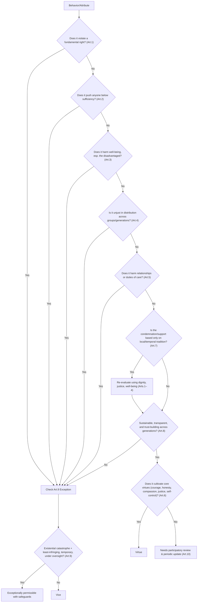

# Illustrative Decision Tree for Applying the Charter

This decision tree provides a **practical tool** for interpreting the *Human Ethical Charter*.  
It translates the ten articles into a series of questions that help evaluate whether a behavior or attribute is to be considered a **Virtue, Vice, Exception, or Subject to Review**.  

It is not a replacement for the Charter’s principles, but an illustrative guide to support decision-making in real contexts.  

---

## Copyright & License
This document is published under the **Creative Commons Attribution 4.0 International License (CC BY 4.0)**.  

You are free to:
- **Share** — copy and redistribute the material in any medium or format.  
- **Adapt** — remix, transform, and build upon the material for any purpose, even commercially.  

Under the following terms:
- **Attribution** — You must give appropriate credit, provide a link to the license, and indicate if changes were made.  

For details, see: [https://creativecommons.org/licenses/by/4.0/](https://creativecommons.org/licenses/by/4.0/)

Official repository (with timestamps and version history):  
👉 https://github.com/abdnaqeeb/Public/blob/main/Human-Ethical-Charter/Decision-Tree.md

© 2025 The Human Ethical Charter Initiative. All rights reserved under CC-BY 4.0.

